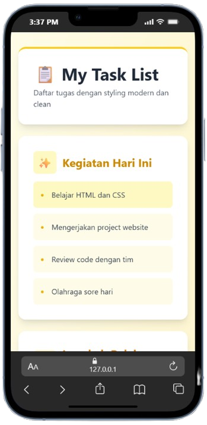
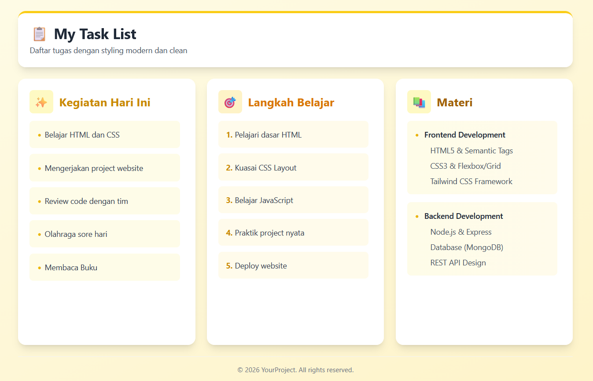

# 📋 RevoU Coding Camp | Day 2 — March 10, 2026
## HTML Lists, Tables, Forms & Tailwind CSS

<p align="center">
  
  
  
</p>

## 📅 Day 2: Advanced Layout, Lists & Tailwind CSS
Eksplorasi mendalam pada struktur HTML untuk membangun pondasi website yang interaktif, terstruktur, dan *mobile-friendly* menggunakan framework utility-first.

---

## 🎯 Materi yang Dipelajari

| Topik | Fokus Utama |
| :--- | :--- |
| **HTML Lists** | Implementasi `<ul>`, `<ol>`, dan hierarki *Nested Lists*. |
| **HTML Tables** | Struktur data tabular yang bersih dengan `<thead>` dan `<tbody>`. |
| **HTML Forms** | Validasi input, berbagai tipe data user, dan *best practices*. |
| **Tailwind CSS** | Integrasi CDN, responsive design, dan manipulasi *utility classes*. |

---

## 🎨 Preview Tampilan
Berikut adalah hasil implementasi desain modern menggunakan **Yellow/Amber Theme** yang sudah dioptimalkan untuk berbagai perangkat:

### 📱 Mobile View


### 💻 Desktop View


---

## 📁 File Structure
Struktur folder diatur secara modular agar mudah dipahami:

```text
.
├── index.html        
├── list.html           
├── table.html         
├── form.html        
├── image.html         
├── images/           
│   ├── list-desktop.png
│   └── list-mobile.png
│   └── revou-logo.png
└── README.md    